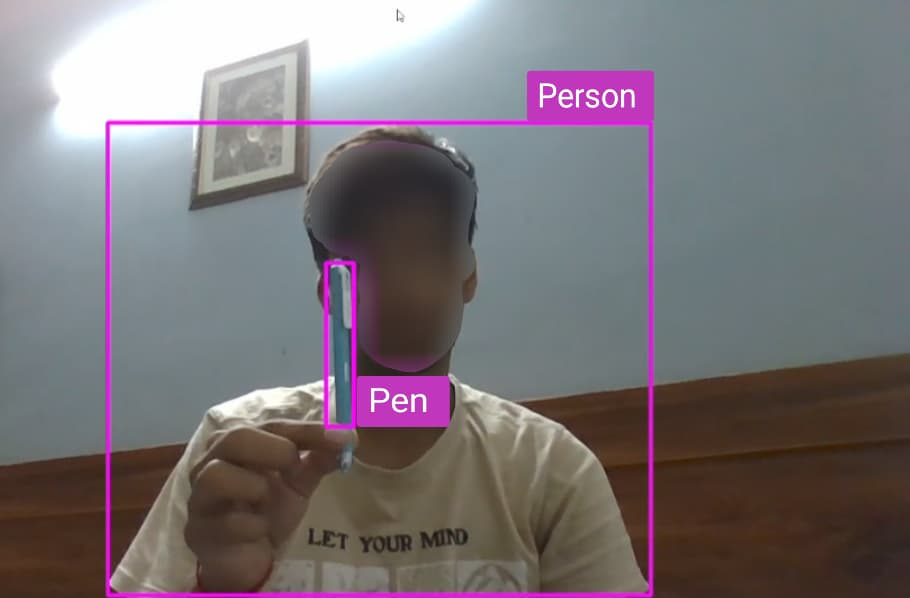

# Real-Time Object Detection with YOLOv5 and OpenCV-

This project uses a pre-trained YOLOv5 model from the Ultralytics library to perform real-time object detection on webcam video feed.

## 🔧 Technologies Used

- Python
- OpenCV
- YOLOv5 (Ultralytics)
- cvzone (for drawing utility)
- NumPy

## 🚀 How It Works

- Captures frames from webcam using OpenCV
- Passes each frame through YOLOv5s model
- Displays bounding boxes, class names, and FPS
- Runs in real-time
- 
## 🧰 Installation

1. Clone this repo or download the files
2. Install dependencies:

```bash
pip install -r requirements.txt
```
## 📸 Demo Screenshots

Here are sample outputs from the real-time object detection system:

### 🧍 Person with Pen


### 🧍 Person with Bottle 


### 🧍 Person with Mobile Phone 


